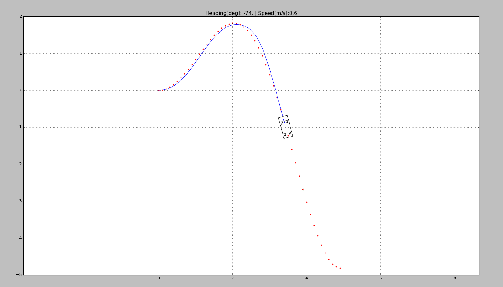
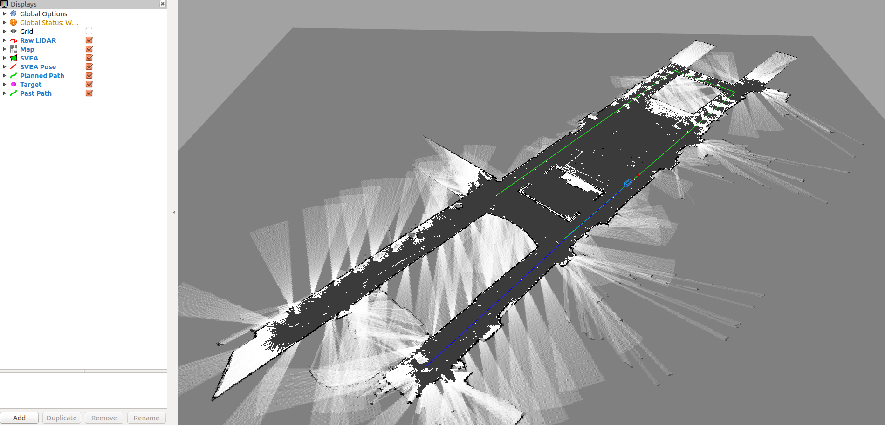

# SVEA Starter Suite

## A short description
This repo contains a basic library of python objects and scripts to make
development on the Small-Vehicles-for-Autonomy (SVEA) platform simpler
and cleaner.

The design principle of this library is to help create projects that are
more modular and easier to troubleshoot. As opposed to the standard
approach of creating a large web of Subscriber/Publisher nodes, we modularly
wrap different ROS entities in Python objects, while exposing only the useful
features with object-oriented interfaces.

## Useful to know before starting
Before continuing to the next sections, consider taking some time to read up on
two important concepts for this code base: the **Robotic Operating System (ROS)**
and **Object Oriented Programming (OOP)**.

To read up on ROS, check out the
[ROS Start Guide](http://wiki.ros.org/ROS/StartGuide). However, do not spend
too much time diving into the guide. The structure and tutorials are not very
intuitive, but glossing over them will give a sense of what ROS is and how you
are meant to use it. The rest of the learning curve is overcome by trying it out
yourself.

To read up on OOP, check out Real Python's
[introduction on OOP](https://realpython.com/python3-object-oriented-programming/).
Focus on understanding why OOP exists and how it is used in Python, not
necessarily how to create new classes themselves.

## Reporting Issues
The preferred way to handle issues is for you to submit issues with the issue
functionality at the top of this page. This allows for a couple benefits:

1. other users will be able to  answer questions they have the solution to
2. ensure questions are visible to all, so anyone else with the same question
can find the answer right away
3. to tie in version control into the issue handling

This also means that it is good to check the issues page carefully before
posting a new issue, in case someone else has also asked the same question
before.

# Installation

## System Requirements
This library is developed on and intended for systems running:

1. [Ubuntu 16.04](https://tutorials.ubuntu.com/tutorial/tutorial-install-ubuntu-desktop-1604#0)
2. [ROS Kinetic](http://wiki.ros.org/kinetic/Installation)
3. Python 2.7

The torrent for Ubuntu 16.04 can be found midway on this
[page](https://www.ubuntu.com/download/alternative-downloads).

Installation guides are linked for Ubuntu and ROS. Python 2.7 will be installed
by default when you install Ubuntu. If you have a newer version of Python also
running on the same system, please make sure Python 2.7 is set as the default.
A good way to check if this is the case is to open a terminal and run

```bash
python
```

to make sure you see "Python 2.7" appear somewhere in the header of the text
that appears afterwards.

If you do not want to install Ubuntu onto your computer, consider installing a
[virtual machine](https://www.osboxes.org/ubuntu/) or use
[docker](https://docs.docker.com/install/) with Ubuntu 16.04 images. Both VMs
and Docker work well on Windows and MacOS. Unfortunately, we do not currently
have a Docker image on hand with all the requirements installed, so you will
have to do the installation yourself.

Some may need to install some additional python tools:

1. [numpy](https://scipy.org/install.html)
2. [matplotlib](https://matplotlib.org/users/installing.html)

Make sure to install the **Python 2.7** version of the above packages.

Some will also need to run:

```bash
sudo apt-get install ros-kinetic-robot-localization \
		     ros-kinetic-mrpt-map \
		     ros-kinetic-mrpt-navigation \
		     ros-kinetic-urg-node
```

## Installing the library
Start by going to the folder where you want the code to sit using terminal.
For example, choose the home directory or a directory for keeping projects in.
Once you are in the chosen directory, use the command:

```bash
git clone https://github.com/KTH-SML/svea_starter
```

to download the library. Then, a new directory will appear called
"./svea_starter". Go into the directory with command:

```bash
cd svea_starter
```

Finally, compile and link the libraries using:

```bash
catkin_make
source devel/setup.bash
rospack profile
```

To make sure the libraries are linked in the future, also call:

```bash
echo "source <path-to-svea-starter>/devel/setup.bash" >> ~/.bashrc
source ~/.bashrc
```

where you need to replace "\<path-to-svea-starter\>" with the file path to
wherever you cloned "svea_starter". For example, the full path might look like
"/home/nvidia/avtct/devel/setup.bash". **Note, you only need to do this once.**

# Usage

The intended workflow with the code base is as follows:
1. Write new features/software
2. Debug the new contributions in simulation
3. Perform basic tuning and adjustments in simulation
4. Evaluate actual performance on a SVEA car

The simulated vehicles provide identical interfaces and information patterns
to the real SVEA cars, thus by following this workflow, most development work
can be done in simulation and code can be directly ported to the real cars with
little effort.

There are two pre-written scripts to serve as examples of how to use the
code base in simulation. See and read the source code in
"svea_starter/src/svea/src/scripts/sim".

You can try them out by running one of the two commands:

```bash
roslaunch svea keyteleop.launch
```

for a keyboard teleop example. Once launched, you should see the following:


where you can use arrow keys to control the simulated SVEA car.

For a pure pursuit example, call:

```bash
roslaunch svea pure_pursuit.launch
```

where you should see something that looks like:



To run a more involved example, call:

```bash
roslaunch svea floor2_sim.launch
```

where you should see something that looks like:



## Going from simulation to real

Since the simulated SVEA cars are built to function very similarly to the real
SVEA cars, the transfer from simulation to real vehicles is fairly simple!

### Low-level Interface Setup

To your roslaunch file, add

```xml
<!--open serial connection for controlling SVEA-->
<node pkg="rosserial_python" type="serial_node.py" name="serial_node">
    <param name="port" value="/dev/ttyACM0"/>
    <param name="baud" value="250000"/>
</node>
```

Then, you just have model mismatch to deal with.


### Sensor setup

To grant the necessary permissions for the NVIDIA TX2 to comunicate with the IMU, run: 

```bash
sudo bash <svea_starter_root>/src/svea_sensors/grant_i2c_permisions.sh
```

If you are not using Qualysis or another motion capture system, and need localization, you need to setup the ZED ROS wrapper and add persmisions for the IMU.

Get the ZED ROS wrapper:
```bash
cd <svea_starter_root>/src
git clone https://github.com/stereolabs/zed-ros-wrapper.git
```

For the ZED ROS wrapper to work, you run ```catkin_make``` again after cloning the directory. The ZED ROS wrapper will *not* be included in the svea_starter by default since it requires dependencies that may not run on all computers easily. If you have problems with the compilation of the ZED ROS wrapper, refer to their [github repo](https://github.com/stereolabs/zed-ros-wrapper)'s README.

There are several options for SLAM/localization shown in ```svea_starter/src/svea_sensors/launch/```. For even more options, explore [mrpt_navigation](http://wiki.ros.org/mrpt_navigation).

### RC Remote

When the RC remote is not in override mode, it's inputs will still be received by the SVEA platform. This gives you the opportunity to use the remote in your project scripts, whether it's for debugging, data collection, or even imitation learning. The RC input is published to ```/lli/remote```.

### Listening to ROS on another computer

Since you will not be able to drive the SVEA cars with a display plugged in, it can be useful to link a computer that does have a display to the SVEA car's ROS network. This will let you use [RVIZ](http://wiki.ros.org/rviz) and [PlotJuggler](http://wiki.ros.org/plotjuggler) on the computer with a display while accessing the data streams on the SVEA car. This amounts to telling the computer with a display where the ROS master it should be listening to (in this case, it should listen to the ROS master running on the SVEA car) is located on the network. On both the SVEA car and the computer with a display, run:

```bash
<svea_starter_root>/scripts/export_ros_ip.sh
```

You can test if this worked by launching something on the SVEA car in the same terminal where the export commands were run and then calling ```rostopic list``` on the computer with a display in the same terminal where the export commands were run. You should see the topics you expect to be on the SVEA car also available on the computer with a display. If this worked, you have some options for how you want to use it. You can either:
1. call this script everytime you want to link the SVEA car and the computer with a display togther (the script only links the terminal window you run it in),
2. add an [alias](https://mijingo.com/blog/creating-bash-aliases) to the end of the SVEA car and the computer's ```~/.bashrc``` to create a new bash command,
3. you can add the contents of ```export_ros_ip.sh``` directly to the end of your ```~/.bashrc```,

or some other preferred approach.

## Documentation

There is documentation available for the current SVEA API. To access it open
docs/\_build/index.html in your favorite browser.

# Contributing

Interested in contributing to the code or features?

Start by emailing:

frankji@kth.se

Adding stable and properly stylized code to an existing code base is a regular
task for professional engineers in the tech world and is often a skill that is
evaluated in programming interviews.

To learn how to program and style Python code, refer to the following
standardized style guide:

[PEP 8 -- Style Guide for Python](https://www.python.org/dev/peps/pep-0008/#introduction)

**TL;DR - "code is read much more often than it is written" -Guido/Pep 8, use
4-space indents, each line must have < 80 characters (IMO), no uneccesary
whitespace, use good naming systems, be readable, be logical.**

As usual, practice makes perfect! Style guides take a little time to get used
to, but once you overcome the learning curve, the rewards are worth it.
If you are interested, consider using the SVEA code base to practice, as the
style checking on contributions will be strict to ensure the code base is clean
and user-friendly.
